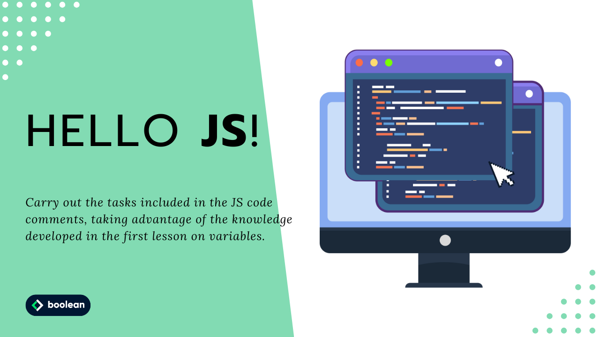

 
Diciassettesimo Esercizio Classe #137 - Boolean

---

Studente: Fabio Ferrero

---
# English

## Target of the project:
Carry out the tasks included in the JS code comments, taking advantage of the knowledge developed in the first lesson on variables.

---
# Italiano

## Obiettivo del progetto:
Svolgere le task inserite nei commenti del codice JS, sfruttando le conoscenze sviluppate nella prima lezione sulle variabili.
---

---
All'interno della repo sono hostate le 3 pagine dell'esercizio.